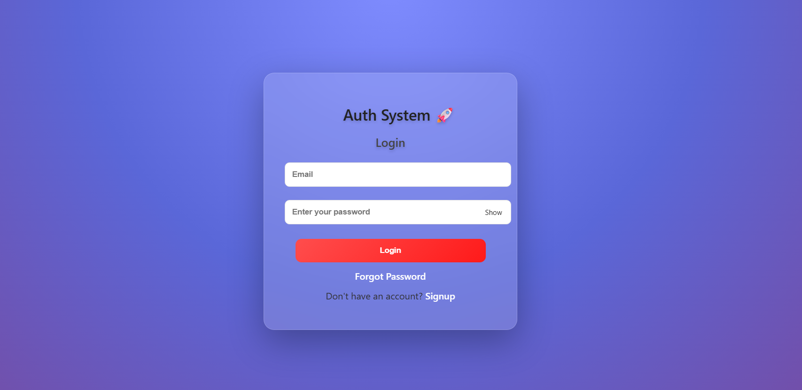
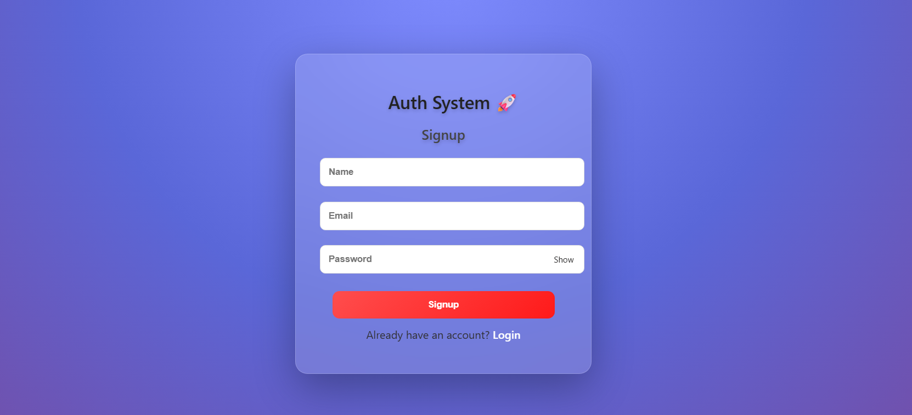
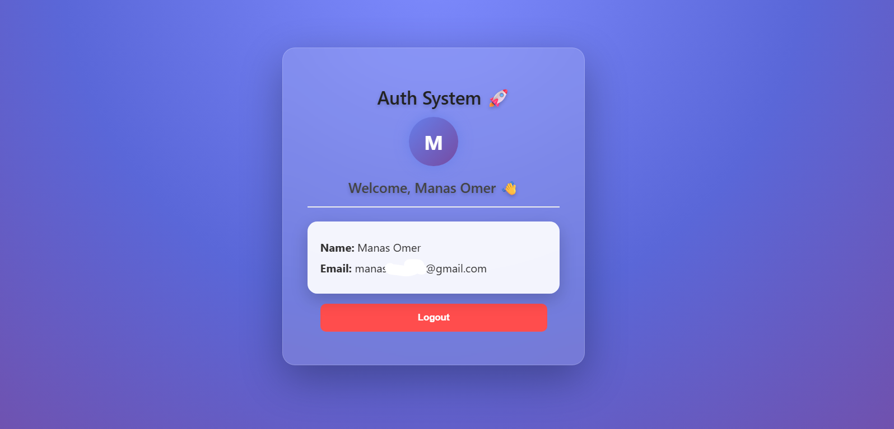
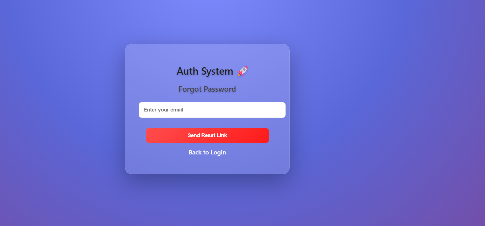
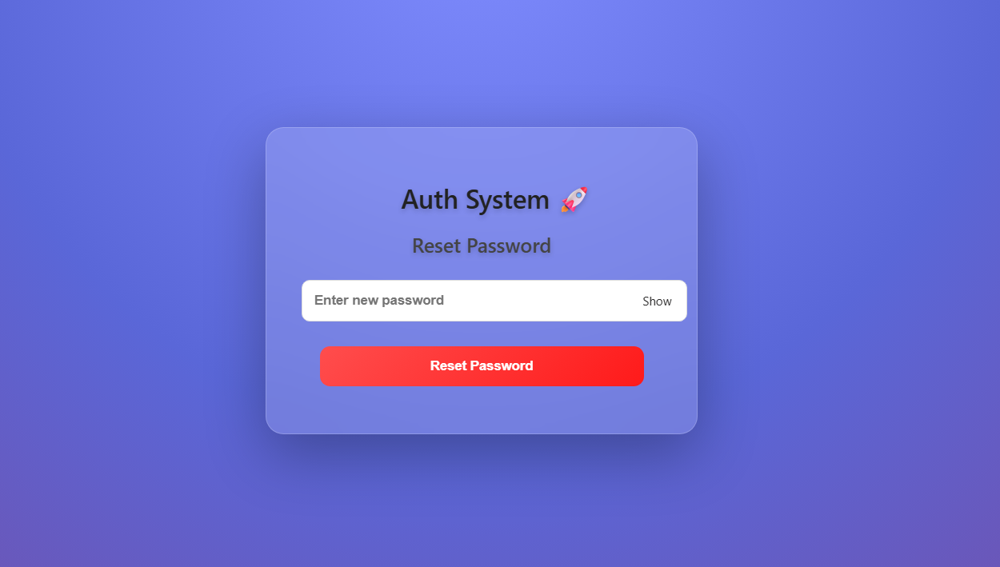

# 🔐 MERN Authentication System

A full-stack authentication system built using the MERN stack with secure JWT-based login and email password reset functionality.

---

## 🌐 Live Demo

https://mern-auth-system-przh.vercel.app/

---

## 🚀 Features

* User Signup & Login
* JWT Authentication
* Protected Routes
* Forgot Password (Email using Resend)
* Reset Password via Token
* Modern UI with React

---

## 🛠 Tech Stack

* Frontend: React.js
* Backend: Node.js, Express.js
* Database: MongoDB Atlas
* Authentication: JWT
* Email: Resend
* Deployment: Vercel

---

## 📸 Screenshots

### 🔐 Login Page


### 📝 Signup Page


### 📊 Dashboard


### 📧 Forgot Password


### 📧 Reset Password


---

## ⚙️ Installation

### Backend

```bash
cd backend
npm install
npm run dev
```

### Frontend

```bash
cd frontend
npm install
npm start
```

---

## 🔑 Environment Variables

```env
MONGO_URI=your_mongo_uri
JWT_SECRET=your_secret
EMAIL_API_KEY=your_resend_key
```

---

## 📌 API Routes

* POST /api/auth/signup
* POST /api/auth/login
* GET /api/auth/profile
* POST /api/auth/forgot-password
* POST /api/auth/reset-password/:token
